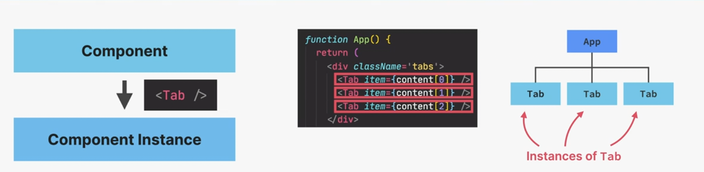
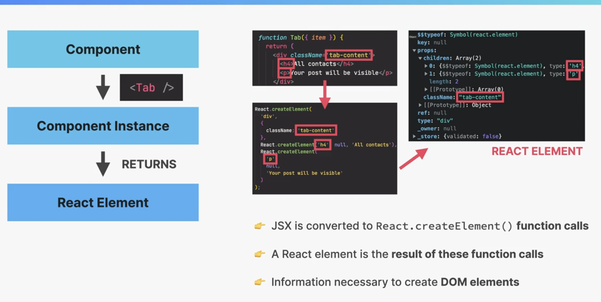
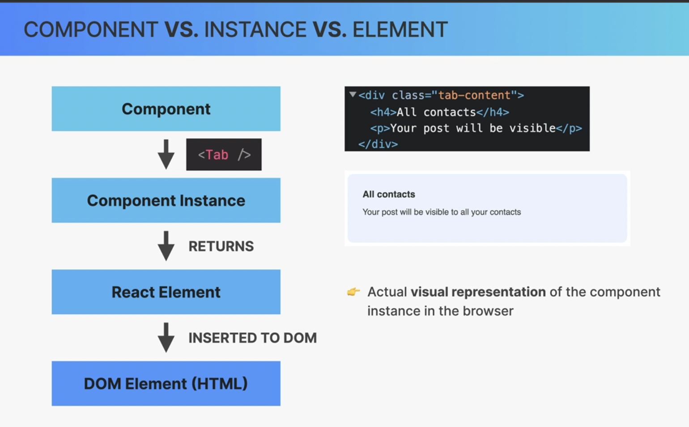

# Component
- Description piece of UI
- That is a function returns React elements(element tree), usually written use JSX 
# Component Instances

- Instances are created when we "use" component
- Actual "physical" manifestation of a component
- Has its own state and props
- It has a lifecycle (be born, live, die)
# React Elements

- JSX is converted to React.createElement() function calls
- A React Element is a result of these function calls.
- Information necessary to create DOM Elements
# DOM Elements

- Actual visual representation of React component instance in the browser

# Notes
- We can 
    ```
        console.log(<Component>)
        console.log(Component()) // call Component function
        Component({item: {a: 1}}) // call and pass props -> but this is not really a Component on DOM
    ```